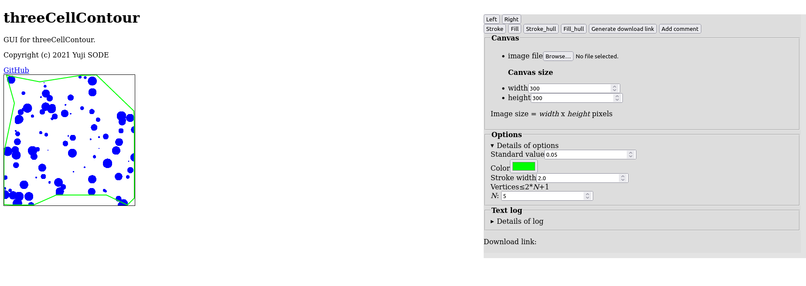
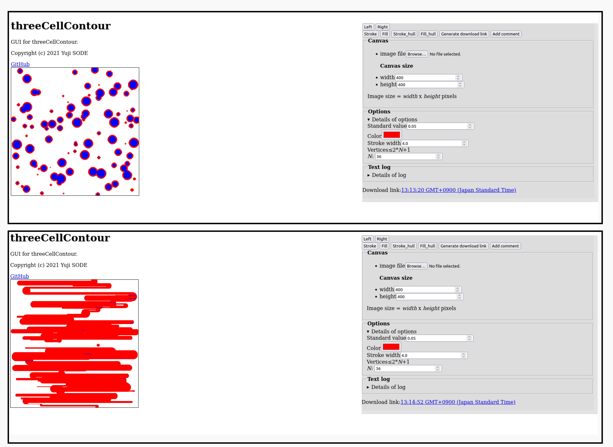

# Change Log 
## [Unreleased]

## [1.0] - 2022-06-29
## Changed
- [`LICENSE`] line 3: the year of Copyright was changed from ` Copyright (c) 2021 Yuji Sode` to ` Copyright (c) 2021-2022 Yuji Sode`
- [`index.html`] lines 3, 16 and 58: changed from `v0.4` to `v1.0`

## [1.0] - 2022-06-28
## Removed
- [`README.md`] lines 16 and 17

## [1.0] - 2022-06-27
## Removed
- [`algorithm.md`] lines 44-76: removed deprecated description of polygonal approximation in [v0.2-v0.4]
- [`wallClockTime_randomN_v03_curves.png`]: removed deprecated image
- [`3CC_wallClockTime_randomN.js`]: removed deprecated script
- [`3CC_sample01_v03_20220109StrokeHulls_lowQuality.jpg`]: removed image

## Changed
- [`README.md`] line 22:  
  ```
   - [`index.html`](index.html): GUI
  ```
- [`README.md`] line 19:  
  ```
   - [`threeCellContour_hull_v04.js`](threeCellContour_hull_v04.js) [v0.4+]: tool to extract hull contour from a image.
  ```

## Removed
- [`README.md`] line 22

## [1.0] - 2022-06-27
## Removed
- [`README.md`] lines 8, 30-32 and 34

## Changed
- [`README.md`] lines 19 and 20: removed keyword `new`

## Removed
- [`README.md`] line 13

## Changed
- [`README.md`] line 24:  
  ```
   - [`index.html`](index.html) [v0.4+]: GUI
  ```
- [`index.html`]: renamed from `index_v04.html` to `index.html`
- [`README.md`] line 24:  
  ```
   - [`index_v04.html`](index_v04.html) [v0.4+]: GUI
  ```

## Removed
- [`README.md`] lines 23 and 24
- [`README.md`] lines 17 and 18
- [`threeCellContour_hull.js`]: removed tool to extract hull contour from a image of [`v0.2-v0.4`]
- [`polygonalHull.js`]: removed additional Array method to estimate a convex hull with polygonal approximation of [`v0.2-v0.4`]
- [`index.html`]: removed `index.html` of [`v0.2-v0.4`]

## Released: [0.4.1] - 2022-06-24
## [0.4.1] - 2022-06-24
## Fixed
- [`algorithm.md`] line 81: `1. Sample clustering`

## Released: [0.4] - 2022-06-24
## [0.4] - 2022-06-24
## Fixed
- [`wallClockTime_randomN_v04.pdf`]: fixed format

## [0.4] - 2022-06-22
## Added
- [`algorithm.md`] lines 76, 79-100 and 106: added explanation for the algorithm in `clusteredHull.js` [+v0.4]
- [`wallClockTime_randomN_v04.pdf`]: computational complexity in `[v0.4]`

## Fixed
- [`clusteredHull.js`] line 136: fixed a comment

## [0.4] - 2022-06-21
## Added
- [`algorithm.md`] lines 79-82:  
  ```
  ### Computational complexity
  - [script](3CC_wallClockTime_randomN_v04.js)
  
  
  ```

## [0.4] - 2022-06-21
## Changed
- [`README.md`] lines 34 and 35:  
  ```  
    <!--  -->
    <!--  -->
  ```

## Added
- [`README.md`] lines 36 and 37:  
  ```
  <!--  -->
  
  ```
- [`wallClockTime_randomN_v04_curves.png`]: added result graph for computational complexity in [v0.4]
- [`SShot_3CC_v04Test20220127_02.png`]: added screenshot of [v0.4]
- [`3CC_wallClockTime_randomN_v04.js`]: added script for computational complexity in [v0.4]
- [`algorithm.md`] lines 77-79:  
  ```
  ## Algorithm in [`clusteredHull.js`](clusteredHull.js) [+v0.4]
  
  ___
  ```

## Fixed
- [`README.md`] line 22: fixed a link:  
  ```
  - [`threeCellContour_hull_v04.js`](threeCellContour_hull_v04.js): new tool to extract hull contour from a image.
  ```

## [0.4] - 2022-02-02
## Added
- [`README.md`] lines 17, 18 and 25: added `<**Deprecated**>`

## Deprecated
- [`index.html`]
- [`threeCellContour_hull.js`]
- [`polygonalHull.js`]

## Added
- [`README.md`]: added descriptions on some new scripts with version 0.4 in `## Scripts`
- [`threeCellContour_hull_v04.js`]: new tool to extract hull contour from a image (`v0.4`).
- [`index_v04.html`]: new interface (`v0.4`)
- [`clusteredHull.js`]: new Array method to approximate a convex hull with clustering (`v0.4+`)

## Changed
- [`index.html`] line 58: added a link to new version (`v0.4`)
- [`index.html`] lines 3, 16 and 57: added version (`v0.3`)

## [0.4] - 2022-01-31
## Changed
- [`threeCellContour_hull.js`] lines 23 and 24: lines were exchanged

## Released: [0.3] - 2022-01-22
## [0.3] - 2022-01-22
## Added
- [`3CC_sample01_v03.js`]: script that draws sample data on canvas element

## [0.3] - 2022-01-20
## Added
- [`algorithm.md`] lines 69-75:  
  ```
  ### Computational complexity
  - polygonal approximation with `2*`_`N`_`+1` vertices
  - number of sample set is 36
  - range of _`N`_ is expressed by minimum, average and maximum
  - [script](3CC_wallClockTime_randomN.js)
  
  
  ```
- [`3CC_wallClockTime_randomN.js`]: script for computational complexity

## Fixed
- [`README.md`] added line 10

## Canged
- [`README.md`] lines 8 and 9:  
  ```
  <!--  -->
  
  ```
- [`README.md`] lines 23-27:  
  ```
  
  ______
  <!--  -->
  
  
  ```

## Added
- [`3CC_sample01_v03_20220109StrokeHulls_lowQuality.jpg`] added sample image of polygonal approximation:  
  
- [`3CC_sample01_v03_20220109Stroke_Fill.png`] added contour sample image:  
  
- [`wallClockTime_randomN_v03_curves.png`] added a graph of computational complexity at `polygonalHull.js/Array.prototype.polygonalHull(N)`:  
  
- [`algorithm.md`] lines 68 and 69:  
  ```
    
  ___
  ```
- [`algorithm.md`] lines 47-49:  
  ```
  **`polygonalHull.js/Array.prototype.polygonalHull(N)`**  
  This algorithm estimates a convex hull with polygonal approximation.
  
  ```
- [`algorithm.md`] lines 6 and 7:  
  ```
  
  **`threeCellContour.js/threeCellContour(srcCanvasId,standard)`**  
  ```

## [0.3] - 2022-01-16
## Fixed
- [`algorithm.md`] line 45: ` ### Polygonal approximation of convex hull`

## [0.3] - 2022-01-14
## Fixed
- [`algorithm.md`] line 51:  
  ```
  _`Pi`_` = (`_`xi`_`,`_`yi`_`)`, _`Po`_` = (`_`c`_`,`_`yo`_`)`, _`O`_` = (`_`xo`_`,`_`yo`_`)` and _`c`_`>`_`xo`_.  
  ```
- [`algorithm.md`] line 49: ` O---Po`

## [0.3] - 2022-01-10
## Added
- [`algorithm.md`] lines 58-62:  
  ```
  _**`T`**_`= (`_`T`_`0, ...,`_`Tj`_`) = (`_`x`_`0`,_`y`_`0, ...,`_`xj`_`,`_`yj`_`)`.  
  
  [+v0.3]  
  _`L`_`3 = (min(`_**`T`**_`) +max(`_**`T`**_`))*0.3`.  
  Returned value is comosed of _`Tj`_, that is not less than _`L`_`3`.
  ```

## Fixed
- [`algorithm.md`] lines 51 and 52:  
  ```
   _`Pi`_` = (`_`xi`_`,`_`yi`_`)`, _`Po`_` = (`_`c`_`, 0)`, _`O`_` = (`_`xo`_`,`_`yo`_`)` and _`c`_`>`_`xo`_.  
   Let _**`pi`**_ and _**`O`**_ be vector _`Pi`_`-`_`O`_ and vector _`Po`_`-`_`O`_.  
  ```

## [0.3] - 2022-01-08
## Changed
- [`polygonalHull.js`] line 203:
  ```
   	return Object.values(tList).reduce((e1,e2)=>{let E=e2[2]<l2Avg3?0:e1.push(e2[0],e2[1]);E=null;return e1;},[]);
  ```
- [`polygonalHull.js`] line 201:
  ```
   	arr0=n0=i=pi_n=T=norm2=X=Y=xMin=xMax=yMin=yMax=xMid=yMid=vOP=norm2List=setVector=Norm2=null;
  ```

## Added
- [`polygonalHull.js`] lines 196-198:
  ```
	//
	norm2List=Object.values(tList).reduce((e1,e2)=>{let E=e1.push(e2[2]);E=null;return e1;},[]);
	l2Avg3=(Math.min(...norm2List)+Math.max(...norm2List))*0.3;
  ```
- [`polygonalHull.js`] line 125:
  ```
   		norm2List=[],l2Avg3=0.0,
  ```

## [0.3] - 2021-12-31
## Fixed
- [`polygonalHull.js`] line 164:  
  ```
   		T=Math.floor(T+0);
  ```

## [0.3] - 2021-12-30
## Changed
- [`index.html`] line 216:  
  ```
   					log.value+=`${!log.value?'':'\n'}time:${(new Date()).toJSON()},standard:${Std.value},color:${Color.value},target:${Width.value}x${Height.value},type:fill_hull,maxVertices:${2*VerticesN.value+1}`;
  ```
- [`index.html`] line 213:  
  ```
   					threeCellContour.getFill_hull('threeCellContourCvs',Std.value,VerticesN.value,Color.value);
  ```
- [`index.html`] line 209:  
  ```
   					log.value+=`${!log.value?'':'\n'}time:${(new Date()).toJSON()},standard:${Std.value},color:${Color.value},stroke:${StrokeWidth.value},target:${Width.value}x${Height.value},type:stroke_hull,maxVertices:${2*VerticesN.value+1}`;
  ```
- [`index.html`] line 206:  
  ```
   					threeCellContour.getContour_hull('threeCellContourCvs',Std.value,VerticesN.value,Color.value,StrokeWidth.value);
  ```
- [`index.html`] lines 150 and 151:  
  ```  
					StrokeWidth=slf.document.getElementById('inputStrWidth'),
					VerticesN=slf.document.getElementById('inputN_vertices');
  ```

## Added
- [`index.html`] lines 99 and 100:  
  ```
  
						<!-- polygonal approximation -->
						<div><label>Vertices&#8804;2*<i>N</i>+1<br><i>N</i>: <input type='number' id='inputN_vertices' value=36 min=1 step=1 required></label></div>
  ```

## Changed
- [`threeCellContour_hull.js`] line 196:  
  ```
   		hull=xyArr.polygonalHull(vN).radSort();
  ```


## Removed
- [`threeCellContour_hull.js`] lines 194-197

## Added
- [`threeCellContour_hull.js`] line 152:  
  ```
   	vN=vN<1?1:vN;
  ```

- [`threeCellContour_hull.js`] line 140:  
  ```
   	// - vN: a number of vertices is not greater than 2*vN+1
  ```

## Changed
- [`threeCellContour_hull.js`] line 136:  
  ```
   threeCellContour.getFill_hull=async (srcCanvasId,standard,vN,color)=>{
  ```
- [`threeCellContour_hull.js`] line 102:
  ```
   		hull=xyArr.polygonalHull(vN).radSort();
  ```

## Removed
- [`threeCellContour_hull.js`] lines 98-101

## Added
- [`threeCellContour_hull.js`] line 55:  
  ```
   	vN=vN<1?1:vN;
  ```

- [`threeCellContour_hull.js`] line 42:  
  ```
   	// - vN: a number of vertices is not greater than 2*vN+1
  ```

## Changed
- [`threeCellContour_hull.js`] line 39:  
  ```
  threeCellContour.getContour_hull=async (srcCanvasId,standard,vN,color,strokeWidth)=>{
  ```

## Added
- [`threeCellContour_hull.js`] line 30:  
  ```
  * 	- `vN`: a number of vertices is not greater than 2*vN+1
  ```

## Changed
- [`threeCellContour_hull.js`] lines 23 and 24:  
  ```
  * - `threeCellContour.getFill_hull(srcCanvasId,standard,vN,color);`
  * - `threeCellContour.getFill_hull(srcCanvasId,standard,vN);`
  ```
- [`threeCellContour_hull.js`] lines 17-19:  
  ```
  * - `threeCellContour.getContour_hull(srcCanvasId,standard,vN);`
  * - `threeCellContour.getContour_hull(srcCanvasId,standard,vN,color);`
  * - `threeCellContour.getContour_hull(srcCanvasId,standard,vN,color,strokeWidth);`
  ```

## Fixed
- [`index.html`] lines 20-22: added to updated CSS
- [`index.html`] lines 45-49: removed second `canvas{...}` to updated CSS
- [`algorithm.md`] line 54:  
  ```
   and _`N`_ is an integer value for _`dt`_`=`_`π`_`/`_`N`_, where _`t`_`= [-`_`π`_`,`_`π`_`]`.
  ```

## [0.3] - 2021-12-29
## Fixed
- [`README.md`] lines 14 and 15:
  ```
  - [`polygonalHull.js`](polygonalHull.js) [v0.2+]: additional Array method to estimate a convex hull with polygonal approximation.
  - [`threeCellContour_hull.js`](threeCellContour_hull.js) [v0.2+]: tool to extract hull contour from a image.
  ```
  
- [`algorithm.md`] line 52:  
  ```
  Let _**`pi`**_ and _**`O`**_ be vector _`Pi`_`-`_`O`_ and vector _`P`_`0 -`_`O`_.  
  ```

## Released: [0.2] - 2021-12-29
## [0.2] - 2021-12-29
## Added
- [`algorithm.md`] lines 42-58: added Algorithm in [`polygonalHull.js`]

## Changed
- [`algorithm.md`] line 4:  
  ```
  ## Algorithm in [`threeCellContour.js`](threeCellContour.js)
  ```

## Added
- [`README.md`] lines 19-21:  
  ```
  
  ## Compatibility
  - Firefox `95.0.1+` (64-bit)
  ```

## [0.2] - 2021-12-26
## Added
- [`README.md`] lines 15:  
```
- [`threeCellContour_hull.js`](threeCellContour_hull.js) (`v0.2+`): tool to extract hull contour from a image.
```

- [`README.md`] line 14:  
```
 - [`polygonalHull.js`](polygonalHull.js) (`v0.2+`): additional Array method to estimate a convex hull with polygonal approximation.
```

- [`README.md`] lines 14 and 15:  
```

### HTML
```

- [`index.html`] lines 204-218: to add tool to extract hull contour  
```
				ScanHullB.addEventListener('click',()=>{
					threeCellContour.getContour_hull('threeCellContourCvs',Std.value,Color.value,StrokeWidth.value);
					//
					//to add scan log
					log.value+=`${!log.value?'':'\n'}time:${(new Date()).toJSON()},standard:${Std.value},color:${Color.value},stroke:${StrokeWidth.value},target:${Width.value}x${Height.value},type:stroke_hull`;
				},false);
				//
				FillHullB.addEventListener('click',()=>{
					threeCellContour.getFill_hull('threeCellContourCvs',Std.value,Color.value);
					//
					//to add scan log
					log.value+=`${!log.value?'':'\n'}time:${(new Date()).toJSON()},standard:${Std.value},color:${Color.value},target:${Width.value}x${Height.value},type:fill_hull`;
				},false);
				//
				//--- download and comment ---
```

- [`index.html`] lines 180 and 181: to add tool to extract hull contour  
>    				//
>   				//--- stroke and fill ---

- [`index.html`] lines 134-137: to add tool to extract hull contour  
>        					/* --- */
>        					ScanHullB=slf.document.getElementById('scan_hullB'),
>        					FillHullB=slf.document.getElementById('fill_hullB'),
>        					/* --- */

- [`index.html`] lines 70-73: to add tool to extract hull contour  
>				<!-- -->
>				<button id='scan_hullB' type='button'>Stroke_hull</button>
>				<button id='fill_hullB' type='button'>Fill_hull</button>
>				<!-- download and comment -->

- [`index.html`] lines 66 and 67: to add tool to extract hull contour  
>    				<br>
>    				<!-- stroke and fill -->

- [`index.html`] lines 52-54: to add tool to extract hull contour  
>    		<!-- -->
>    		<script type='text/javascript' src='polygonalHull.js'></script>
>    		<script type='text/javascript' src='threeCellContour_hull.js'></script>

- [`threeCellContour_hull.js`]: Tool to extract hull contour from a image.
- [`polygonalHull.js`]: additional Array method to estimate a convex hull with polygonal approximation. this algorithm does not require sorting sample in advance.

## [0.2] - 2021-12-24
## Removed
- [`threeCellContour.js`] line 373: `//===================================================================`

## [0.2] - 2021-12-23
## Removed
- [`threeCellContour.js`] lines 252 and 253:  tool to extract hull contour from a image.

  >        		//
  >        								//n=v.log.length;

## Released: [0.1] - 2021-12-05

## Released: [0.0] - 2021-12-05

## [0.1] - 2021-11-22
## Fixed
- [`index.html`] line 175:  
  >` 				ScanB.addEventListener('click',()=>{`

## Changed
- [`index.html`] line 179: changed log output by `Stroke` (= `Scan`) can also include `type:stroke`
- [`index.html`] line 63: changed button name from `Scan` to `Stroke`

## Added
- [`index.html`] line 108: added a link to GitHub (`https://github.com/YujiSODE/threeCellContour`)
- [`index.html`] lines 64 and 124: added `Fill` button
- [`index.html`] lines 182-187: added event listener for fill method
- [`threeCellContour.js`] lines 15, 19 and 21-26: added descriptions
- [`threeCellContour.js`] lines 219-374: added a method to fill the contoured area

## [0.0] - 2021-11-22
- original version
