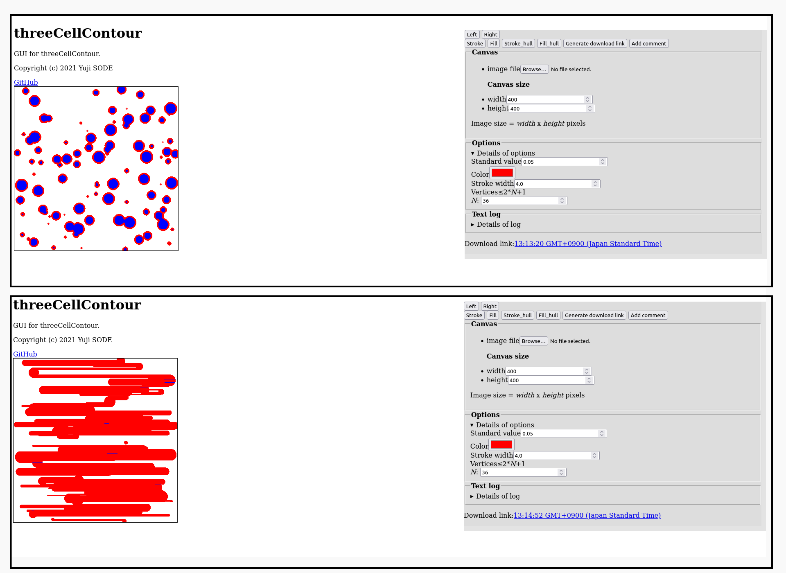
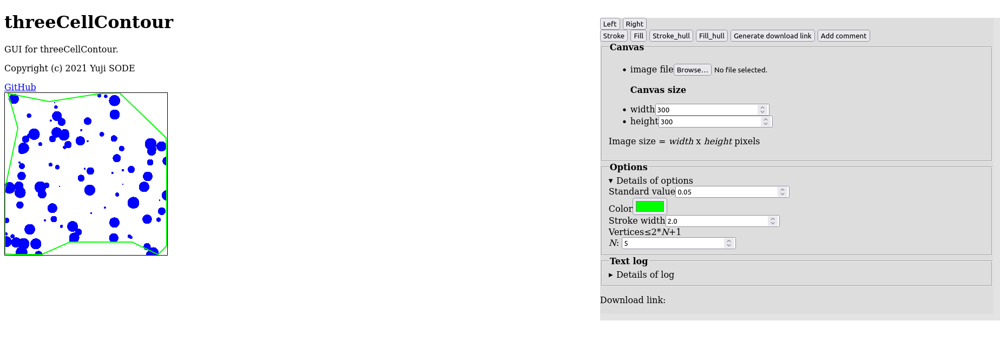

<!-- logo image of "threeCellContour" -->
<h1></h1>

Tool to extract contour from a image.  
GitHub: https://github.com/YujiSODE/threeCellContour  
>Copyright (c) 2021-2022 Yuji SODE \<yuji.sode@gmail.com\>  
>This software is released under the MIT License.  
>See LICENSE or http://opensource.org/licenses/mit-license.php  
______

## [Algorithm](algorithm.md)
This algorithm returns a definition of contour paths.

## Scripts
### JavaScript
- [`threeCellContour.js`](threeCellContour.js): main script
- [`clusteredHull.js`](clusteredHull.js) [v0.4+]: Array method to approximate a convex hull with clustering.
- [`threeCellContour_hull_v04.js`](threeCellContour_hull_v04.js) [v0.4+]: tool to extract hull contour from a image.

### HTML
- [`index.html`](index.html): GUI

## Compatibility
- Firefox `95.0.1+` (64-bit)

______

