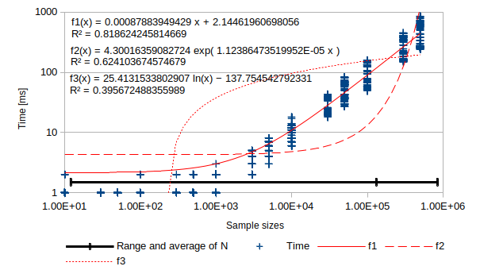

# threeCellContour
Tool to extract contour from a image.

___
## Algorithm in [`threeCellContour.js`](threeCellContour.js)

**`threeCellContour.js/threeCellContour(srcCanvasId,standard)`**  
This algorithm returns a definition of contour paths.

### Paths and a cell
    [C0 C1]
    [C2 --]
Let the current cell be as `C0`, and other cells be `C1` and `C2` in 2x2 px area.  

A difference between two cells _`Di`_ using a standard value _`std`_ is as follows:  
_`D`_`1` `:= ` _`D`_`(`_`C`_`0,`_`C`_`1) > `_`std`_`? 0b10: 0b00`  
_`D`_`2` `:= ` _`D`_`(`_`C`_`0,`_`C`_`2) > `_`std`_`? 0b01: 0b00`  

Result reaction from the current cell _`q`_`0` is estimated bitwise OR,  
_`q`_`0 :=`_`D`_`1|`_`D`_`2 = 0,1,2 or 3`.  

#### Paths when _`q`_`= 0 = 0b00`
    [0 0] = [.. ..]
    [0 -]   [.. --]
    
#### Paths when _`q`_`= 1 = 0b01`
    [0 0] = [__ ..]
    [1 -]   [.. --]
    
#### Paths when _`q`_`= 2 = 0b10`
    [0 1] = [  |..]
    [0 -]   [.. --]
    
#### Paths when _`q`_`= 3 = 0b11`
    [0 1] = [__|..]
    [1 -]   [.. --]
    
### Packing rule
    [0101 ...1]    _|_|_|_| ... _|
    [1010 ...0] => _|_|_|_| ... _|
     :       :     :            : 
    [0101 ...1]    _|_|_|_| ... _|
    
___
## Algorithm in [`polygonalHull.js`](polygonalHull.js) [+v0.2]

**`polygonalHull.js/Array.prototype.polygonalHull(N)`**  
This algorithm estimates a convex hull with polygonal approximation.

### Polygonal approximation of convex hull
```
  Pi
 /
O---Po
```
_`Pi`_` = (`_`xi`_`,`_`yi`_`)`, _`Po`_` = (`_`c`_`,`_`yo`_`)`, _`O`_` = (`_`xo`_`,`_`yo`_`)` and _`c`_`>`_`xo`_.  
Let _**`pi`**_ and _**`O`**_ be vector _`Pi`_`-`_`O`_ and vector _`Po`_`-`_`O`_.  
_`ai`_ is an angle between _**`pi`**_ and _**`O`**_,  
and _`N`_ is an integer value for _`dt`_`=`_`π`_`/`_`N`_, where _`t`_`= [-`_`π`_`,`_`π`_`]`.

Polygonal approximation of convex hull is _**`T`**_.  
_`Tj`_`= max(|`_**`pj`**_`|)`, where _`j`_`= floor(`_`ai`_`/`_`dt`_`)`.  
_**`T`**_`= (`_`T`_`0, ...,`_`Tj`_`) = (`_`x`_`0`,_`y`_`0, ...,`_`xj`_`,`_`yj`_`)`.  

[+v0.3]  
_`L`_`3 = (min(`_**`T`**_`) +max(`_**`T`**_`))*0.3`.  
Returned value is comosed of _`Tj`_, that is not less than _`L`_`3`.

### Computational complexity
- polygonal approximation with `2*`_`N`_`+1` vertices
- number of sample set is 36
- range of _`N`_ is expressed by minimum, average and maximum
- [script](3CC_wallClockTime_randomN.js)


___
