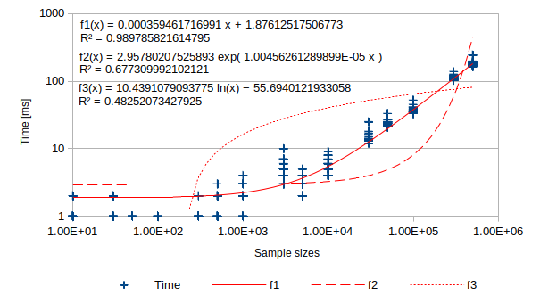

# threeCellContour
Tool to extract contour from a image.

___
## Algorithm in [`threeCellContour.js`](threeCellContour.js)

**`threeCellContour.js/threeCellContour(srcCanvasId,standard)`**  
This algorithm returns a definition of contour paths.

### Paths and a cell
    [C0 C1]
    [C2 --]
Let the current cell be as `C0`, and other cells be `C1` and `C2` in 2x2 px area.  

A difference between two cells _`Di`_ using a standard value _`std`_ is as follows:  
_`D`_`1` `:= ` _`D`_`(`_`C`_`0,`_`C`_`1) > `_`std`_`? 0b10: 0b00`  
_`D`_`2` `:= ` _`D`_`(`_`C`_`0,`_`C`_`2) > `_`std`_`? 0b01: 0b00`  

Result reaction from the current cell _`q`_`0` is estimated bitwise OR,  
_`q`_`0 :=`_`D`_`1|`_`D`_`2 = 0,1,2 or 3`.  

#### Paths when _`q`_`= 0 = 0b00`
    [0 0] = [.. ..]
    [0 -]   [.. --]
    
#### Paths when _`q`_`= 1 = 0b01`
    [0 0] = [__ ..]
    [1 -]   [.. --]
    
#### Paths when _`q`_`= 2 = 0b10`
    [0 1] = [  |..]
    [0 -]   [.. --]
    
#### Paths when _`q`_`= 3 = 0b11`
    [0 1] = [__|..]
    [1 -]   [.. --]
    
### Packing rule
    [0101 ...1]    _|_|_|_| ... _|
    [1010 ...0] => _|_|_|_| ... _|
     :       :     :            : 
    [0101 ...1]    _|_|_|_| ... _|
    
___
## Algorithm in [`clusteredHull.js`](clusteredHull.js) [+v0.4]
It is important for convex hull estimation to exclude internal points efficiently.  
Convex hull approximation is composed of following two phases:  
1. Sample clustering
2. In‐cluster processing

### 1. Sample clustering
A given sample ranges were split into `M x N` clusters.  
An index which belongs to a cluster `idx` is expressed by function expression as follows:  
`idx = I(x,y)`, where `idx, x, y ∈ 0, 1, 2, ...`  
A cluster which is specified with an index is within a convex hull when `x` and `y` satisfy following two conditions:  
```
Min(∂I/∂x) < x < Max(∂I/∂x)
Min(∂I/∂y) < y < Max(∂I/∂y)
```

### 2. In‐cluster processing
Each cluster was approximated geometrically by its elements.  
Each cluster was approximated rectangularly using the minimum and maximum elements in this algorithm.  
The farthest approximated vertex from the center of sample was determined in each cluster.  
The determined vertices represent clusters.  

The result of approximation were determined vertices in above two phases.

### Computational complexity
- [script](3CC_wallClockTime_randomN_v04.js)



___
